# Hey, I'm William 👾

Software Engineering student at the **University of Puerto Rico, Mayagüez** 🇵🇷

---

## 🕹️ selected_projects 

<table>
<tr>
<td width="50%" valign="top">

### 🏃 SportsTracker

**Athlete & Team Analytics Platform**

Data-driven sports platform featuring athlete and team analytics, an ETL pipeline, and a conversational AI assistant powered by locally hosted LLMs.

`Python` `Flask` `PostgreSQL` `pgvector` `Ollama` `Streamlit`

 

</td>
<td width="50%" valign="top">

### 🏠 Condo Rentals

**Student Housing Marketplace**

Multi-team software project for finding student housing near UPRM, with a focus on rental listings, search, filtering, and UI development.

`React Native` `Expo` `REST APIs` `Figma`

 

</td>
</tr>

<tr>
<td width="50%" valign="top">

### 🐸 StudyPet

**Gamified Study Companion**

Mobile study companion that connects study habits with caring for a virtual pet, combining productivity features with game-like interactions.

`React Native` `Expo` `Jest`

 

</td>
<td width="50%" valign="top">

### 👾 NES 6502 Platformer

**Platformer Built in 6502 Assembly**

NES platformer prototype featuring sprite rendering and walking animations implemented at the hardware level in 6502 Assembly.

`6502 Assembly` `ca65` `ld65`

 

</td>
</tr>

<tr>
<td width="50%" valign="top">

### 🟡 Pac-Man Adaptation

**Classic Arcade Game Reimagined**

Custom adaptation of Pac-Man featuring additional gameplay mechanics and power-ups built with C++ and openFrameworks.

`C++` `openFrameworks`

 

</td>
<td width="50%" valign="top">

### 🧩 Sudoku Backtracker

**Recursive Sudoku Solver**

Sudoku solver that uses recursive backtracking to explore possible values and automatically find valid solutions.

`Python` `Backtracking` `Algorithms`

 

</td>
</tr>
</table>

---

## 🛠️ inventory

<table>
<tr>
<td width="50%" valign="top">

### 💻 Languages

 

  

</td>
<td width="50%" valign="top">

### 🎨 Frontend & Mobile

 

  

</td>
</tr>

<tr>
<td width="50%" valign="top">

### 🗄️ Backend & Data

 

  

</td>
<td width="50%" valign="top">

### ⚙️ Tools & Platforms

 

  

</td>
</tr>
</table>

---

## 📊 stats

  

---

## 🐍 contribution_log

<picture>
  <source
    media="(prefers-color-scheme: dark)"
    srcset="https://raw.githubusercontent.com/williammartinez10/williammartinez10/output/github-contribution-grid-snake-dark.svg"
  />
  <source
    media="(prefers-color-scheme: light)"
    srcset="https://raw.githubusercontent.com/williammartinez10/williammartinez10/output/github-contribution-grid-snake.svg"
  />
  
</picture>

 

---

## 📡 connect

Open to connecting, collaborating, and talking about software.

  

&nbsp;

&nbsp;

  

